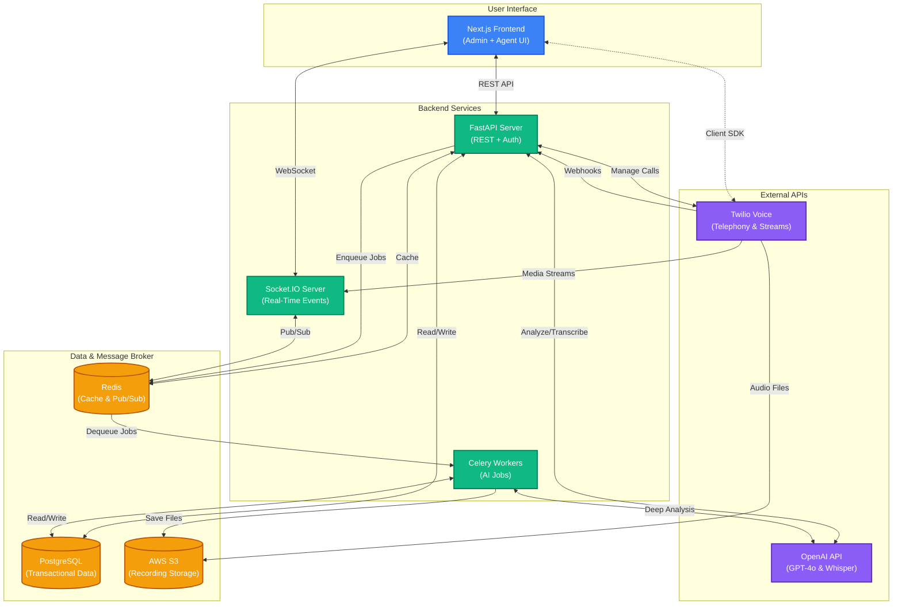
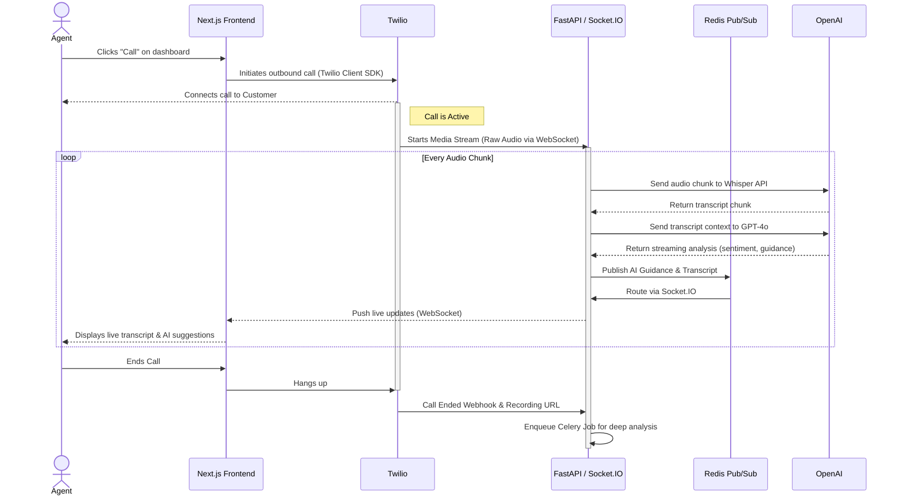

# SalesIQ Architecture Diagrams

This document contains Mermaid diagrams illustrating the architecture of the SalesIQ Real-Time AI Sales & Lead Intelligence Engine, based on the project documentation.

## 1. High-Level System Architecture

This diagram shows the major components of the system and how they interact.



## 2. Real-Time Call Flow

This sequence diagram illustrates the step-by-step data flow during a live sales call, highlighting the real-time AI guidance pipeline.



## 3. Post-Call Analysis & Deal Prediction Flow

This diagram shows how offline Celery workers process the completed call recording and generate deal predictions.

```mermaid
flowchart LR
    classDef process fill:#f472b6,stroke:#be185d,stroke-width:2px,color:#fff
    classDef data fill:#6ee7b7,stroke:#059669,stroke-width:2px,color:#000
    classDef llm fill:#a78bfa,stroke:#4c1d95,stroke-width:2px,color:#fff

    Start([Call Ends]) --> Webhook[Twilio Webhook Received]

    subgraph Celery Task Pipeline
        direction TB
        Webhook --> Download[Download Recording from S3]:::process
        Download --> Transcribe[Full Batch Transcription<br/>(Whisper API)]:::process
        Transcribe --> Analyze[Deep Text Analysis<br/>(GPT-4o)]:::process
        
        Analyze --> Predict[Calculate Deal Prediction<br/>(GPT-4o)]:::process
    end

    subgraph Data Sources
        CRM[(Lead History &<br/>CRM Data)]:::data
        Transcript[(Full Call<br/>Transcript)]:::data
    end

    subgraph Final Outputs
        Summary[Call Summary<br/>& Scorecard]:::data
        Prediction[Win Probability %<br/>& Next Steps]:::data
    end

    Transcribe --> Transcript
    Transcript --> Analyze
    CRM --> Predict
    Analyze --> Predict
    
    Analyze --> Summary
    Predict --> Prediction
    
    Summary --> DB[(PostgreSQL)]
    Prediction --> DB
```
